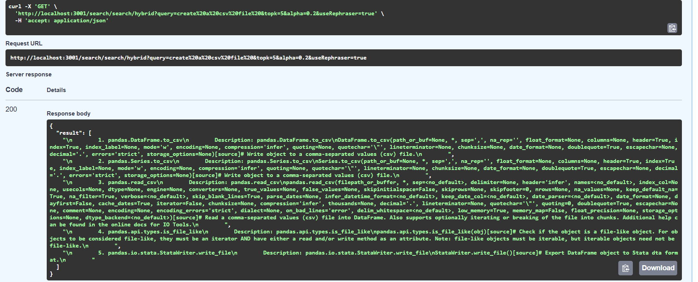

# 📘 DocsNexus--Pandas

**DocsNexus--Pandas** is an educational project that explores semantic search and Retrieval-Augmented Generation (RAG) to improve how developers interact with technical documentation. This prototype specifically targets the `pandas` library, enabling efficient recall of API usage through natural language queries.

---

## 🔍 Motivation

Developers and data engineers often struggle to remember all the functionalities offered by libraries like `pandas`. While reading documentation is crucial, memorizing everything is impractical.

**DocsNexus--Pandas** bridges this gap by allowing semantic search over the official documentation. Users can query in plain language, and the system retrieves the most relevant API information—similar to how RAG systems function.

---

## 🛠️ How It Works

1. **Documentation Ingestion**  
   Parses and processes `pandas/reference/api` content.

2. **Embedding**  
   Uses a bi-encoder model to embed the documentation and also the query.

3. **Vector Storage**  
   Stores the embeddings in a Weaviate vector database.

4. **Query Rephrasing**  
   Before retrieval, a local/cloud LLM rephrases user queries into more precise technical prompts.

5. **Semantic Retrieval**  
   The rephrased query is used to retrieve relevant docs using MIPS algorithm internally by Weaviate.

6. **Cross-Encoder Reranking**
   A cross-encoder BERT based model is used to rerank the retrieved documents before passing the top-k documents ahead.

7. **Generator**
   A local/cloud LLM is used to answer the query given the top-k relevant documents and the query.

---

## 🤖 Models Used

- **Local LLM**: `microsoft/Phi-3-mini-4k-instruct`  
- **Cloud LLM**: `gemma2-9b-it` via [Groq](https://groq.com)
- **Embedding**: `sentence-transformers/multi-qa-mpnet-base-dot-v1`
- **Reranker**: `cross-encoder/ms-marco-MiniLM-L-6-v2`

Both LLMs are used for:
- Rephrasing user queries
- Answer generation from retrieved documentation

We do **not** use LLMs directly for generation, ensuring that results are grounded in the embedded documentation.

---

## 🖼️ Screenshots & Examples


Data Retrival using hybrid search: 



---

## ⚙️ Setup Instructions

We used `uv` as a package manager for python.

```bash
# Clone the repository
git clone https://github.com/SurAyush/DocsNexus--Pandas.git
cd DocsNexus--Pandas

# Start the Weaviate Database
docker compose -f ./docker-compose.yml up -d

# Move and configure to backend directory
cd backend
uv venv
uv sync
.venv/Scripts/activate

# Ingest the pandas documentation
python -m weaviate.load_pandas.data

# Create a .env and save the GROQ_API_KEY

# Launch the semantic search app
python server.py
```

React Based front-end:

```bash
# Move to the frontend directory
cd frontend

# Install dependencies
npm install

# Set up .env and set up VITE_API_URL as the backend url

# Run the app
npm run dev

```

---

## 📌 Notes

- For popular libraries like pandas, LLMs alone may return good answers even without additional context.
- For newly released or lesser-known libraries, DocsNexus can provide much more reliable and grounded responses.
- This is purely an educational project, intended to explore: Information Retrieval, Vector Search, Query Rewriting and RAG pipelines.

---

## 🙌 Contributing

Contributions, suggestions, and feature requests are welcome!
Feel free to fork the project or open an issue.
  
